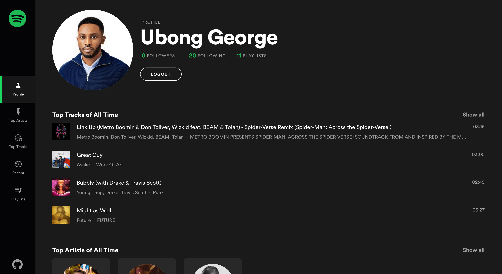

# My Spotify

Insights on personalised Spotify data such as top artists, tracks, playlists, recommendations and more!

## Live Link

[Click to see live](https://my-spotify.vercel.app)

## Built With

- Spotify Web API
- Next.js
- TailwindCSS

## Getting Started

To run the app in a local environment,

- [Register a Spotify app](https://developer.spotify.com/dashboard/applications) and add `http://localhost:3000/api/auth/callback/spotify` as a `Redirect URI` in the app settings
- Clone this project by running `git clone https://github.com/george-swift/my-spotify.git`
- Create an `.env` file in the root of the project based on `.env.example`
- Run `npm install` to install the required dependencies and lastly `npm run dev` to fire up a local server

## Acknowledgments

- [Spotify Development Guides](https://developer.spotify.com/documentation/general/guides/)
- [Inspired by Brittany Chiang](https://newline.co/courses/build-a-spotify-connected-app)

## Authors

👤 &nbsp; **Ubong George**

- LinkedIn: [Ubong George](https://www.linkedin.com/in/ubong-itok)
- Twitter: [@\_\_pragmaticdev](https://twitter.com/__pragmaticdev)
- GitHub: [@george-swift](https://github.com/george-swift)
